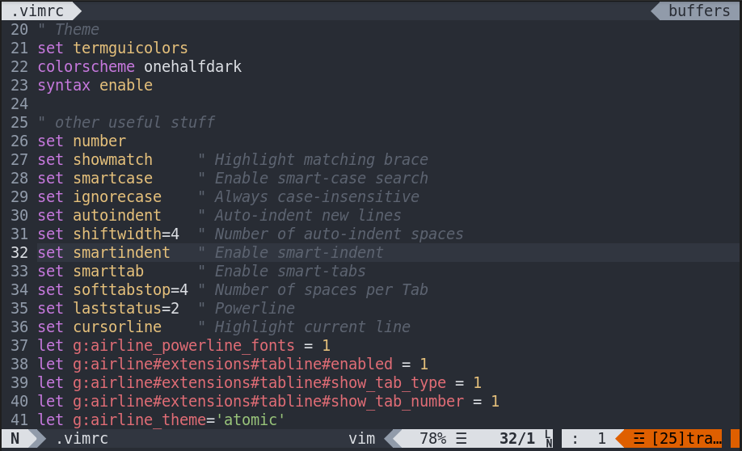

# VIM
These are my Vim files, they are from an Arch Linux machine. If you want them to work in your machine you probably need some dependencies:
``sudo pacman -Syu vim-powerline powerline-fonts vim-airline vim-airline-themes``
Or search for the equivalent packages in your distro's repositories.
 

